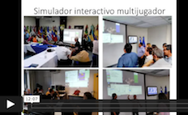

# Modulo-MiRoya es una pagina que presenta el modelo de simulación "MiRoya_Dynacof".

Este pagina oferece :
## Guías de usuario
  - Video de introduccion que explica el objetivo de MiRoya: 
      
      https://www.dropbox.com/s/buex3bzspw1epcy/ObjetivoMiRoya.avi?dl=0   o
      https://vimeo.com/508424457   o
      https://youtu.be/D7UvZCKfv-A
  - Sobre MiRoya (descripcion del modelo conceptual, autores,...): DescripcionMiRoya.pdf
      (https://docs.google.com/document/d/1FqfNjFibNa-D-UMh9fB-AZciLiN7587fYLxRWzsE1Is/edit?usp=sharing)
  - Instalación y configuración del modelo: Instalacion de MiRoya-DynaCof.pdf 
      (https://docs.google.com/document/d/10EcWSSYgbH9FWK5OqCio1YgfBlcJS1dITUgemayLsMA/edit?usp=sharing)
  - Uso de MiRoya: GuíaUsuarioModelo_MiRoya.pdf
      (https://docs.google.com/document/d/1R2HFJIzu0FBC03I4sdNyVd46LxXLc9KWcmflsATmnSc/edit?usp=sharing)
      
## Archivos R para ejecutar simulaciones (DynaCof y MiRoya-DynaCof)
## La plataforma CORMAS: 
  cormas2020_package.zip
  Está también disponible en el sitio http://cormas.cirad.fr
## Archivos Smalltalk para ejecutar MiRoya
